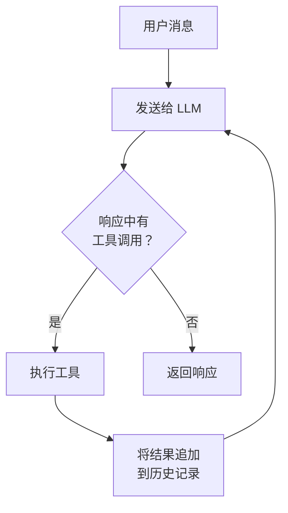
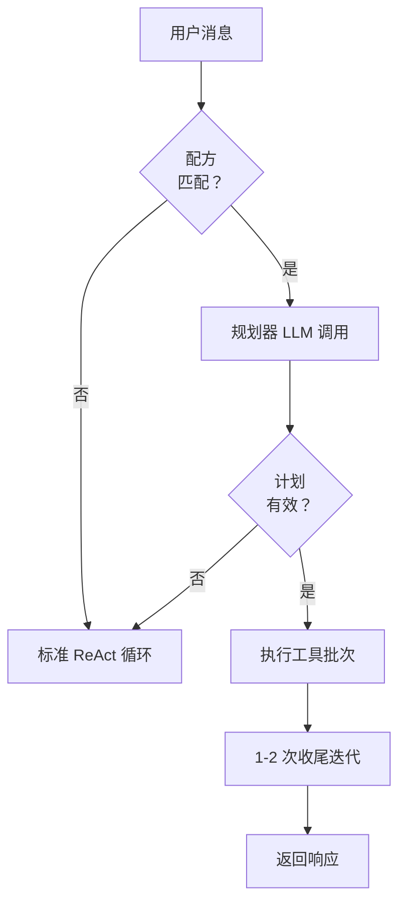

# Agent 循环

聊天机器人一次性回复。Agent 会循环。这是理解 Obsilo 最关键的一点。

当你发送一条消息时，Obsilo 会将其连同系统提示词和工具定义一起传递给语言模型。模型会返回文本、工具调用，或两者兼有。如果存在工具调用，Obsilo 会执行它们，将结果追加到对话历史中，然后将所有内容发送回模型。这个过程不断重复，直到模型仅返回文本、调用 `attempt_completion`，或安全限制停止循环。

整个循环存在于一个文件中：`src/core/AgentTask.ts`。

## 循环图示

仅此而已。本页其余内容都是关于控制、保护和扩展这个循环的。

## 每一步发生了什么

循环从组装包含 16 个模块化部分的系统提示词开始：模式定义可用工具、活跃规则、已加载技能、记忆上下文等。系统提示词会被缓存，只在发生变化时重建（模式切换、工具可用性切换）。

组装好的提示词和对话历史会被发送到 AI 提供商。Obsilo 流式传输响应，为每个文本块触发 `onText()`，并收集所有 `tool_use` 块。

如果响应中包含工具调用，每个调用都会经过 `ToolExecutionPipeline`（`src/core/tool-execution/ToolExecutionPipeline.ts`）。该管道会验证路径、检查审批要求、在写操作前创建检查点、执行工具并记录结果。没有工具能绕过这个管道，即使是来自外部服务器的 MCP 工具也不例外。

来自并行安全集合的只读工具（`read_file`、`search_files`、`semantic_search` 等）通过 `Promise.all()` 并发运行。写工具和控制流工具则逐个运行。

工具结果会作为结构化结果块返回到对话历史中。然后循环将更新后的历史记录发送给模型进行下一次迭代。

当模型仅返回文本且无工具调用，或当它调用 `attempt_completion` 时，循环结束，响应返回到 UI。

## AgentTask 构造函数

`AgentTask` 接受 12 个参数来控制循环行为。

| 参数 | 默认值 | 作用 |
|------|--------|------|
| `api` | 必填 | AI 提供商处理器（Anthropic 或 OpenAI） |
| `toolRegistry` | 必填 | 中心工具注册表 |
| `taskCallbacks` | 必填 | 文本、工具事件、完成的 UI 回调 |
| `modeService` | 可选 | 模式切换和 Web 工具开关 |
| `consecutiveMistakeLimit` | `0`（关闭） | 连续 N 次工具错误后中止 |
| `rateLimitMs` | `0`（关闭） | 迭代之间的最小毫秒数 |
| `condensingEnabled` | `true` | 自动上下文压缩 |
| `condensingThreshold` | `70` | 当 token 超过上下文窗口的此百分比时压缩 |
| `powerSteeringFrequency` | `0`（关闭） | 每 N 次迭代重新注入模式指令 |
| `maxIterations` | `25` | 循环迭代的硬上限 |
| `depth` | `0` | 当前子 agent 嵌套深度 |
| `maxSubtaskDepth` | `2` | 生成的子 agent 的最大嵌套深度 |

`run()` 方法接受一个配置对象，包含用户消息、任务 ID、初始模式、对话历史，以及可选的规则、技能和记忆等上下文。

## 快速路径执行

并非每个任务都需要完整的 ReAct 循环。当 agent 曾经解决过同类型的任务时，它可以跳过大部分迭代推理，执行预先计划好的工具调用序列。这就是快速路径，是系统中单次 token 成本优化的最大来源。

快速路径依赖于配方系统（参见[记忆](./memory-system)）。当用户消息到达时，`RecipeMatchingService` 检查是否存在匹配的配方。如果找到一个匹配且已成功使用至少三次，快速路径就会激活：

1. 单一的规划器 LLM 调用接收用户消息加上配方，并生成一个具体的执行计划：一个包含工具调用参数的 JSON 数组。
2. 该计划通过相同的 `ToolExecutionPipeline` 确定性地执行，不再进行进一步的 LLM 调用。读操作并行运行，写操作顺序执行。
3. 执行完成后，正常的 agent 循环接管一到两次最终迭代，以形成响应并呈现结果。

快速路径通常需要两到三次 LLM 调用和约 70,000 个 token，而不是八次 LLM 调用和 634,000 个 token。

快速路径有护栏。如果规划器产生无效的 JSON 或引用了未知的工具，系统会回退到标准 ReAct 循环。所有工具调用仍然通过 `ToolExecutionPipeline` 进行审批检查、检查点和日志记录。没有任何治理被绕过。

## 上下文外部化

工具结果积累在对话历史中，并在每次 API 调用时重新发送。语义搜索返回 20,000 个字符。读取一条笔记又增加 20,000 个。经过八次迭代后，仅工具结果就可能超过 250,000 个 token。

上下文外部化在大型工具结果进入历史之前将其拦截。当结果超过 2,000 个字符时，完整内容会被写入临时文件。历史记录收到一个紧凑的引用：发现了什么、具有相关性分数的顶部条目，以及完整数据所在的文件路径。

`ResultExternalizer`（`src/core/tool-execution/ResultExternalizer.ts`）处理此事，在每次工具执行后从 `ToolExecutionPipeline` 调用。外部化对工具透明：它们照常返回完整结果。管道决定什么进入历史记录。

临时文件存储在 `.obsidian-agent/tmp/{taskId}/` 中，具有确定性名称（`{toolName}-{callIndex}.md`）。没有时间戳，没有随机值，因此文件路径不会使 KV 缓存失效。清理在任务完成后进行，并在插件启动时对超过一小时孤立目录进行安全扫描。

在快速路径执行期间，外部化被禁用。最后的 LLM 调用需要完整内容以进行良好的摘要，而且由于只有两到三次迭代，积累很小。

历史记录严格保持仅追加原则。外部化在结果创建时发生，而不是追溯性地进行。KV 缓存和上下文压缩共享这一原则：如果历史记录事后被修改，它们都无法工作。

## 安全护栏

循环有多重机制防止失控行为。

迭代限制：软限制在 `maxIterations` 的 60%，硬限制在 `maxIterations`（默认 25）。在软限制时，agent 会收到完成警告。在硬限制时，循环无条件终止。

连续错误追踪：每次工具错误都会增加计数器。成功的调用将其重置为零。如果计数器达到 `consecutiveMistakeLimit`，循环中止。这可以阻止 agent 在一个错误方法上消耗 token。

工具重复检测：`ToolRepetitionDetector` 保持最近 15 次工具调用的滑动窗口。如果相同的工具以相同输入出现 3 次或更多次，它会被阻止。对于搜索工具，检测器还会使用 Jaccard 相似性捕获语义上相似的查询。被阻止的调用会返回可恢复的错误，以便 agent 可以尝试其他方法。

速率限制：当设置 `rateLimitMs` 时，每次迭代会暂停至少这么多个毫秒。这是一个简单的 API 成本控制节流阀。

## 上下文压缩

语言模型的上下文窗口是有限的。包含许多工具调用的长对话会很快填满。上下文压缩处理这个问题。

当 `condensingEnabled` 为真且估计的 token 数量超过模型上下文窗口的 `condensingThreshold` 百分比时，压缩触发。首先，`onPreCompactionFlush` 触发，以便重要事实可以在修剪之前持久化到记忆中。然后对话历史被总结成紧凑表示，替换原始消息。

如果 API 返回表示上下文溢出的 400 类错误，无论阈值如何都会触发紧急压缩。然后阈值重置为 80% 以避免重复触发。

## 动力转向

模型会漂移。在具有多次迭代的长循环中，agent 可能逐渐忘记其分配的角色，开始表现得泛化。动力转向对抗这一点。

当 `powerSteeringFrequency` 设置为诸如 4 的值时，循环每 4 次迭代注入一条合成用户消息。此消息提醒模型其活跃模式、角色定义和活跃技能名称。它不占用额外的 API 调用；它是下一次迭代之前对话历史中的附加消息。

## 多 Agent：生成子 Agent

`new_task` 工具让 agent 为子任务生成一个子 `AgentTask`。子 agent 获得新的对话历史（无父上下文泄露）、自己的模式和深度计数器加一。为保持子 agent 精简快速，压缩和动力转向对子 agent 被禁用。

父级的审批回调被转发给子级，因此来自子 agent 的写操作仍然需要人工审批。

当子级达到 `maxSubtaskDepth`（默认 2）时，`new_task` 工具会从其可用工具中完全移除，防止无限递归生成。来自子级的 token 使用量累积到父级的总数中以进行准确的成本追踪。

## 下一步

继续阅读[工具系统](./tool-system)，了解工具如何通过治理管道注册、验证和执行。