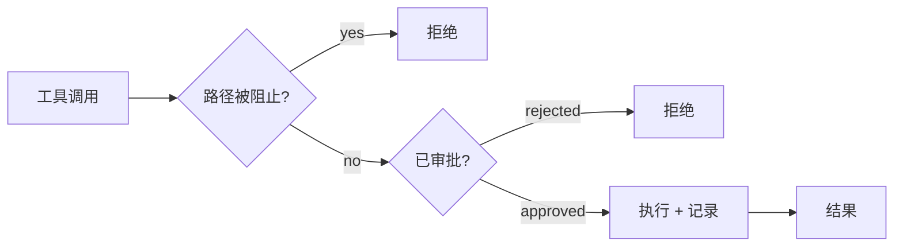

# 治理

这就是为什么可以放心地给 AI 提供笔记的写权限。

核心原则是fail-closed（故障即拒绝）。如果在审批检查过程中出现任何问题——无论是缺失回调、配置未加载，还是意外错误——操作都会被拒绝。Agent 绝不会静默自动审批。每个工具调用，无论是内部还是 MCP，都会经过一个中央管道。

## 管道

`ToolExecutionPipeline`（`src/core/tool-execution/ToolExecutionPipeline.ts`）是唯一的执行点。任何操作都无法绕过它。

三个问题，依次判断：路径是否允许？操作是否已审批？只有通过这两个检查，工具才会运行。执行后，结果会被记录。

## 路径保护

保险库根目录下的两个文件控制着 Agent 可以访问哪些路径：

| 文件 | 作用 |
|------|------|
| `.obsidian-agentignore` | Agent 完全看不见的路径。使用 gitignore 语法。 |
| `.obsidian-agentprotected` | 可读取但绝对不可写的路径，即使有明确审批也不行。 |

两个文件都使用 glob 模式。像 `journal/private/**` 这样的行会阻止该文件夹下的所有内容。

某些路径无论配置如何都会被阻止：`.git/`、Obsidian 工作区文件以及缓存文件。治理配置文件本身始终受到写保护，因此 Agent 无法编辑自己的限制。

`IgnoreService`（`src/core/governance/IgnoreService.ts`）负责执行此规则。如果模式尚未加载完成，它会拒绝所有访问。同样遵循 fail-closed 原则。

## 审批分类

每个工具都被归类到一个审批组。该组决定操作是自动运行还是需要人工同意。

| 组 | 示例 | 默认行为 |
|-------|----------|-----------------|
| `read` | read_file, search_files, semantic_search | 自动审批 |
| `note-edit` | write_file, edit_file, append_to_file | 需要审批 |
| `vault-change` | create_folder, delete_file, move_file | 需要审批 |
| `web` | web_fetch, web_search | 启用网络工具时自动审批 |
| `agent` | attempt_completion, switch_mode, update_todo_list | 始终自动审批 |
| `subtask` | new_task | 可配置 |
| `mcp` | use_mcp_tool | 可配置 |
| `skill` | execute_command, call_plugin_api | 可配置 |
| `sandbox` | evaluate_expression | 需要明确 opt-in |
| `self-modify` | manage_skill, manage_source | 始终需要人工审批，无法绕过 |

自我修改工具是最高严格级别的类别。Agent 可以创建和编辑自己的技能与源代码，但每次变更都必须由人工审批。没有针对该组的自动审批设置。

对于笔记编辑，审批界面可以显示按 Markdown 结构分组的语义差异（前置matter、标题、列表、代码块），而不是原始行块。你可以审批、拒绝或在确认前编辑各个部分。

## 检查点

在任何写操作之前，管道会对受影响的文件进行 git 快照。这使用位于 `.obsidian/plugins/obsilo-agent/checkpoints/` 的影子仓库，由 `isomorphic-git`（纯 JavaScript，无需原生 git 二进制文件）驱动。

`GitCheckpointService`（`src/core/checkpoints/GitCheckpointService.ts`）在工具修改文件之前，将其当前内容提交到影子仓库。每个检查点记录任务 ID、提交哈希、时间戳、变更文件以及触发它的工具。检查点之前不存在的文件会单独跟踪，以便恢复时可以删除它们。

结果：任何任务之后，都可以撤销所有更改。撤销是细粒度的：每次写操作都有自己的检查点，因此可以回滚到任何中间状态。保险库自身的 git 历史（如果有的话）不会被触碰。

## 审计日志

每次工具调用都会通过 `OperationLogger`（`src/core/governance/OperationLogger.ts`）记录到 JSONL 文件。每天一个文件，存储在 `.obsidian/plugins/obsilo-agent/logs/YYYY-MM-DD.jsonl`。超过 30 天的文件会被自动删除。

每条记录包含：

| 字段 | 内容 |
|------|---------|
| `timestamp` | ISO 8601 |
| `taskId` | 触发此次调用的任务 |
| `mode` | 当时的活跃模式 |
| `tool` | 工具名称 |
| `params` | 输入参数（已脱敏） |
| `result` | 输出摘要（上限 2000 字符） |
| `success` | 调用是否成功 |
| `durationMs` | 执行时间 |

敏感值（密码、令牌、API 密钥）在记录前会被替换为 `[REDACTED]`。文件内容字段记录为 `[N chars]` 而非完整文本。URL 中的凭证会被剥离。

日志在会话期间仅追加写入。你可以用任何理解 JSONL 的工具读取它，或使用内置的 `read_agent_logs` 工具让 Agent 分析自己的历史。