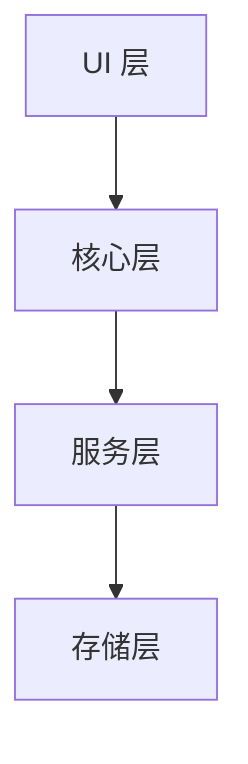

# Obsilo 工作原理

Obsilo 是一个 AI 智能体，运行在 Obsidian 中作为社区插件使用。你向它发送消息，它调用工具来读取和修改你的保险库（vault），然后循环执行直到任务完成。本节将解释这个循环及其周围的基础设施。

## 思维模型

暂时忘掉聊天界面。聊天机器人接收你的消息，生成回复，然后停止。Obsilo 做的事情不同：它接收你的消息，生成可能包含工具调用的回复（读取文件、运行搜索、编辑笔记），执行这些工具，将结果反馈给语言模型，然后重复。这个循环持续进行，直到模型决定完成或安全限制将其切断。

这个循环就是整个架构的精髓。其他一切——审批系统、提示组装、记忆层、模式系统——都是为了使这个循环安全、有用和可扩展而存在的。

## 分层架构

Obsilo 有四个层级。每一层只依赖于它下面的层。

UI 层是侧边栏、设置面板和模态框。它向下发送用户消息，并向上渲染返回的任何内容。

核心层是智能体循环所在的地方。`AgentTask` 编排对话，`ToolExecutionPipeline` 管理每个工具调用，系统提示构建器组装告诉模型可以做什么的指令。

服务层包含领域逻辑：语义搜索、记忆、MCP 集成、Office 文档生成、技能系统和代码沙箱。核心层在执行工具时调用这些服务。

存储层是 Obsidian 的保险库（vault）。所有读写都通过 `app.vault` 和 `app.fileManager`，从不通过原始文件系统调用。这使 Obsilo 与 Obsidian 的同步、索引和插件生态系统兼容。

## 设计原则

Obsilo 是本地优先的。你的数据永远不会离开你的机器，除了到你配置的 AI 提供商的 API 调用。没有云服务、没有遥测、没有账户。

安全模型是失败关闭的。写操作默认需要用户明确批准。如果批准回调缺失或损坏，管道会拒绝该操作。这个逻辑在 `ToolExecutionPipeline` 中，而不是在各个工具中，因此没有单个工具可以绕过它。

插件是一个平台。你可以通过 MCP 服务器扩展它以进行外部工具集成，编写自己的技能来教智能体新行为，并使用沙箱在运行时运行代码。智能体可以检查自己的日志并创建新技能，但始终在你的监督下进行。

## 目录结构

| 目录 | 内容 |
|-----------|-------------|
| `src/core/` | AgentTask、管道、系统提示、模式、治理、检查点 |
| `src/core/tools/` | 49 个工具实现（vault、web、agent、MCP、动态） |
| `src/core/tool-execution/` | 执行管道、重复检测器、操作日志 |
| `src/core/prompts/sections/` | 16 个模块化提示部分构建器 |
| `src/api/` | AI 提供商抽象（Anthropic、OpenAI） |
| `src/ui/` | 侧边栏、设置、模态框、首次使用引导 |
| `src/i18n/` | 国际化（英文、德文） |
| `src/types/` | 共享 TypeScript 类型和设置 |

## Kilo Code 传承

Obsilo 的核心循环和工具架构改编自 Kilo Code，这是一个开源的 AI 编码智能体。该改编用 Obsidian 的保险库 API 替换了文件系统操作，添加了用于批准和检查点的治理层，并引入了用于知识管理的领域特定工具。

## 后续阅读

从[智能体循环](./agent-loop)开始，这是本节中最重要的页面。它解释了消息如何变成多步骤任务。从那里，[工具系统](./tool-system)涵盖了工具如何注册、验证和执行。[治理页面](./governance)解释了批准和安全模型。