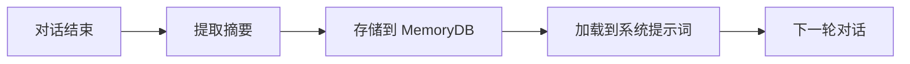

# 记忆

如果没有记忆，每次对话都从零开始。你需要重新解释你的偏好、项目需求和写作风格。Obsilo 通过三个层级的记忆在不同对话之间持久化信息，每个层级有不同的生命周期和用途。

## 三个层级

**会话记忆**是自动运作的。当一段对话结束时，系统会提取一份摘要：讨论了什么、做出了什么决定、使用了哪些工具。这些摘要保存在 `memory.db`（SQLite，与知识层使用相同的引擎）的 `sessions` 表中。你无需管理会话记忆，它会自动积累。经过数百次对话后，档案会成为一份可搜索的日志，记录你与智能体共同完成的所有工作。

**长期记忆**存储关于你和你工作的持久性事实。`MemoryService`（`src/core/memory/MemoryService.ts`）管理着 `~/.obsidian-agent/memory/` 目录下的五个 Markdown 文件：

| 文件 | 内容 | Token 预算 |
|------|------|------------|
| `user-profile.md` | 你的姓名、角色、沟通偏好 | ~200 tokens |
| `projects.md` | 活跃项目及其上下文 | ~300 tokens |
| `patterns.md` | 智能体学习到的行为模式 | ~200 tokens |
| `soul.md` | 智能体身份与性格 | ~200 tokens |
| `knowledge.md` | 领域知识（仅按需加载，不在系统提示词中） | 无限制 |

每个文件在注入系统提示词时有 800 字符的硬性上限，所有文件合计最多 4,000 字符。这样可以在保持记忆有用性的同时，不占用上下文窗口。

字符预算在提取时强制执行，而不仅仅在注入时。`LongTermExtractor` 将预算作为硬性约束接收："此文件最多 800 字符。如果添加新信息会超出预算，请删除或压缩最不相关的现有条目。" 每个条目都带有 `[YYYY-MM]` 时间标签，以便提取器决定删除什么。如果没有预算强制执行，记忆文件会无限增长。一年后，可见的那 800 字符会被陈旧的条目填满，而更新、更相关的信息则被截断在外。

Soul 是一个特殊的案例。它定义了智能体的沟通方式：语言、语气、价值观、反模式。默认的 soul 说德语，避免填充短语，优先考虑实用性而非礼貌。你可以直接编辑 `soul.md` 来重塑智能体的性格。

两个辅助文件作为补充：`errors.md` 记录智能体遇到的已知错误模式，`custom-tools.md` 记录智能体创建的动态工具和技能。两者都是按需加载，而不是出现在每个系统提示词中。

## 记忆的流动

在每轮对话开始时，系统会将 `user-profile.md`、`projects.md`、`patterns.md` 和 `soul.md` 加载到系统提示词中。`knowledge.md` 不包含在自动加载中，仅通过语义搜索按需检索，以避免将潜在无关的信息浪费在上下文中。

`MemoryRetriever`（`src/core/memory/MemoryRetriever.ts`）读取每个文件，截断到字符预算限制，然后组装成组合记忆块。如果某个文件尚不存在，系统会在首次访问时根据模板创建它。模板是最简化的：标题和占位符字段，智能体在了解你的过程中会填充这些内容。

## MemoryDB

`MemoryDB`（`src/core/knowledge/MemoryDB.ts`）是一个独立于知识层的 SQLite 数据库。它在四个表中存储结构化数据：

| 表 | 用途 |
|-------|---------|
| `sessions` | 带标题、来源、时间戳的对话摘要 |
| `episodes` | 单独的任务执行：用户消息、使用的工具、成功/失败 |
| `recipes` | 学到的和静态的程序化配方（通过意图匹配从 episodes 提升而来） |
| `patterns` | 早期基于序列匹配的遗留表（不再写入） |

数据库位于 `{vault-parent}/.obsidian-agent/memory.db`，并在多个保险库之间共享。无论你打开哪个保险库，智能体都记得你。

Episodes 是最细粒度的单位。每个 episode 记录一次单独的用户请求、当前模式、调用工具的确切序列、工具结果的账目，以及任务是否成功。这些数据为配方系统和"调试设置"标签页中的分析提供支持。

## 记忆更新

智能体通过两条路径更新记忆。**自动提取**发生在对话结束时：系统提取关键事实并将其存储为 sessions 和 episodes。**显式更新**发生在智能体（或你）使用 `update_memory` 工具直接写入记忆文件时。

`update_memory` 工具和 MCP 服务器的 `update_memory` 端点写入相同的文件。如果你通过 MCP 在 Claude Desktop 中使用 Obsilo，你的记忆仍然会积累在同一个地方。

你也可以直接在文本编辑器中编辑记忆文件。它们是纯 Markdown。如果智能体学到了关于你的不正确信息，打开 `user-profile.md` 并修复它。修正后的版本会在下一轮对话中生效。

## 配方与意图匹配

随着时间推移，`episodes` 表会揭示模式。当三个或更多相似的 episodes 都成功时，系统会将它们提升为配方：一个通用的、可重用的程序，智能体可以遵循它而无需从头推理。这是快速路径执行的基础（参见[智能体循环](./agent-loop)），对于已知任务类型可将 token 成本降低多达 90%。

配方提升使用语义意图匹配，而不是工具序列匹配。早期版本试图通过比较智能体使用的工具确切序列来检测重复任务（例如 `search_files` -> `read_file` -> `create_note`）。这在实践中从未有效，因为 LLM 不会以确定性的方式选择工具。三个功能相同的任务会产生三个不同的工具序列，导致三个独立的模式永远不会达到提升阈值。

当前系统使用与知识层相同的嵌入模型，通过余弦相似度比较用户消息。"搜索我关于康德的笔记并总结"和"找到关于黑格尔的一切并创建概述"在相似度上得分很高，无论智能体碰巧使用了什么工具。在三个相似的成功 episodes 之后，`RecipePromotionService` 通过一次 LLM 调用生成配方，将具体示例抽象化为通用步骤序列。

系统附带八个用于常见保险库操作的静态配方（创建画布、按标签重新组织笔记、链接相关文档等）。学到的配方是自动生成的，最多限制为 50 个以防止无限增长。

查询时的配方匹配采用两阶段方法。第一阶段是对配方触发字段进行关键词评分，这很快且不需要 API 调用。第二阶段作为备用方案，检查配方名称和描述中的 token 重叠。合并预算限制在三个配方和 2,000 字符以内，以避免系统提示词膨胀。

配方包含一个 `success_count` 来跟踪它们成功的频率。只有至少三次成功使用的配方才有资格进入快速路径执行。配方使用 `schema_version` 字段进行版本控制，以便在格式更改时迁移旧配方。每个配方都记录它适用于哪些模式，所以在"智能体"模式中学到的配方不会在"问答"模式中建议。

## 入门引导

新用户从空的记忆文件开始。`OnboardingService`（`src/core/memory/OnboardingService.ts`）检测到这一点后会触发首次运行流程，提出几个问题：你的姓名、你喜欢的语言、你使用 Obsidian 做什么。答案会填充 `user-profile.md` 和 `soul.md`，为智能体提供基线。你可以跳过入门引导，让记忆通过对话有机地积累。

## Token 经济

记忆与规则、工具描述和技能竞争系统提示词中的空间。4,000 字符的预算大约相当于 1,000-1,200 tokens（取决于内容）。这是一个有意的权衡：足够有用但不会挤占其他上下文。你可以在源代码中增加每个文件和总字符限制，但这会占用其他系统提示词部分的空间。

`knowledge.md` 文件不在此预算范围内，因为它只在智能体调用语义搜索时加载。它可以无限增长，不会影响系统提示词的大小。