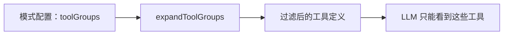

# 模式

模式定义了智能体能做什么以及如何对话。每个模式都有名称、角色定义、工具组合和可选的自定义指令。切换模式后，智能体的能力会立即改变。

## 两个内置模式

Ask（问答模式）是只读的。工具组合：`read`、`vault`、`agent`。智能体可以搜索、读取文件、回答问题和浏览知识库，但无法创建、编辑、移动或删除任何内容。当用户请求写操作时，智能体会调用 `switch_mode` 来升级到 Agent 模式。

Agent（代理模式）拥有完全访问权限。工具组合：`read`、`vault`、`edit`、`web`、`agent`、`mcp`、`skill`。它可以完成 Ask 模式的所有功能，还可以写文件、浏览网页、生成子智能体、调用 MCP 服务器和运行插件命令。

这两个模式定义在 `src/core/modes/builtinModes.ts` 中。

## 自定义模式

除了 Ask 和 Agent 模式外，你还可以创建自己的模式。自定义模式包含标识符、显示名称、角色定义、一个或多个工具组合，以及可选的自定义指令。

自定义模式存储在两个级别：

- 全局级别：位于 `~/.obsidian-agent/modes.json`，在所有保险库中可用。由 `GlobalModeStore`（`src/core/modes/GlobalModeStore.ts`）管理。
- 保险库本地级别：位于插件的特定保险库设置中，仅在该保险库中生效。

如果保险库本地模式的标识符与内置模式相同，则保险库版本将替换内置模式。这让你可以在不丢失原始模式的情况下自定义默认行为。

## 工具过滤的工作原理

每个模式都声明它使用哪些工具组。`ModeService`（`src/core/modes/ModeService.ts`）将这些组展开为单独的工具名称，并在 API 请求中仅向 LLM 传递这些工具。

模型无法调用它看不到的工具。如果你的自定义模式只启用了 `read` 和 `vault`，那么模型的架构中就没有写操作工具。这不是运行时检查——这些工具只是不存在于请求中。

用户可以通过 `setModeToolOverride()` 在模式内进一步限制工具。覆盖只能移除工具，不能添加模式组之外的工具。你可以缩小访问权限，但不能提升权限。

Web 工具还有一个额外的限制：当 `webTools.enabled` 为 false 时，`web_fetch` 和 `web_search` 会从每个模式的工具集中移除，无论配置如何。

## 模式切换

智能体或用户可以在对话中途切换模式。`switch_mode` 工具会保存新的激活模式并触发系统提示重建。工具定义会针对新模式重新过滤，因此下一次迭代会看到不同的能力集。

Ask 模式使用此机制进行升级。当有人请求"创建一个关于 X 的笔记"时，智能体识别到自己无法写操作，便调用 `switch_mode('agent')` 进行交接。

## 多智能体模式传播

当父智能体通过 `new_task` 生成子任务时，它会指定子任务运行的模式。子任务继承父任务的模式限制。一个常见模式：Agent 模式生成一个 Ask 模式的子任务进行研究，使子任务保持只读状态，而父任务负责写操作。

子任务无法超出其分配的模式进行升级。如果它被分配了 Ask 模式，它就会保持在 Ask 模式。

## ModeConfig

每个模式都是一个 `ModeConfig` 对象，包含以下字段：

| 字段 | 用途 |
|-------|---------|
| `slug` | 唯一标识符（如 `ask`、`agent`、`researcher`） |
| `name` | UI 中的显示名称 |
| `toolGroups` | 模式可以访问的工具组 |
| `roleDefinition` | 作为模式身份注入到[系统提示](/concepts/system-prompt)中 |
| `customInstructions` | 附加到系统提示的额外指令 |
| `whenToUse` | 描述何时适合使用此模式 |
| `source` | `built-in`、`global` 或 `vault` |

`ModeService` 按以下顺序检查来源来解析激活的模式：内置模式、然后全局模式、然后保险库本地模式。如果保存的标识符不再存在，则回退到 Ask 模式。