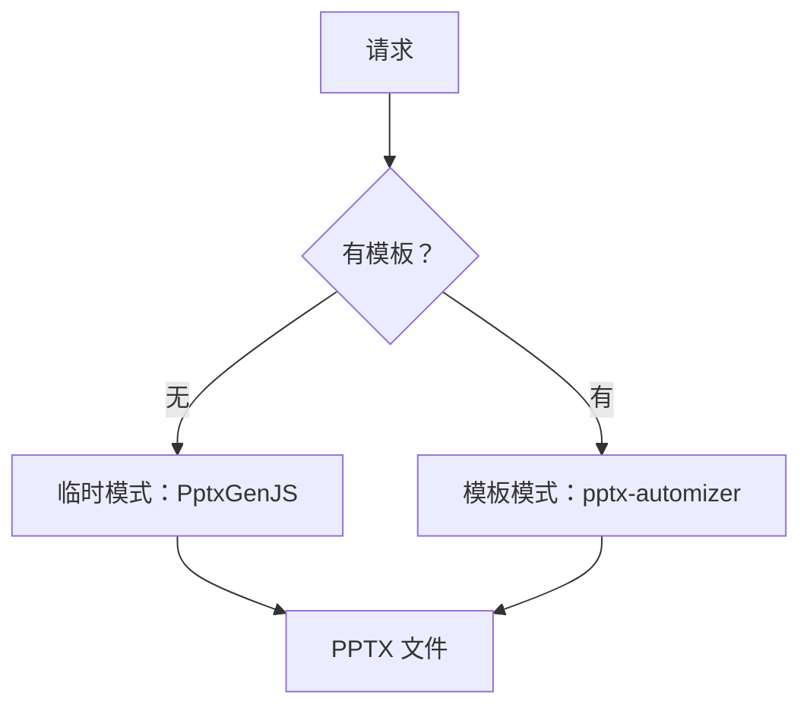

# Office 管道

Obsilo 可以直接在知识库中创建 PowerPoint、Word 和 Excel 文件。它也可以读取这些文件，从 Office 文档中提取文本和结构，用于对话上下文。

## 文档创建

三个内置工具处理文件创建：`create_pptx`、`create_docx` 和 `create_xlsx`。每个工具都使用共享的 `writeBinaryToVault()` 工具将二进制输出写入知识库，并带有路径遍历保护。

DOCX 和 XLSX 的生成比较直接。PPTX 是复杂性最高的部分，因为演示文稿有重要的视觉结构。

## 两种 PPTX 模式

**临时模式**：使用 PptxGenJS 从头构建幻灯片。Agent 指定幻灯片内容（标题、项目符号、图片），库生成一个干净但通用的演示文稿。适合快速草稿或没有公司模板时。

**模板模式**：使用现有的 `.pptx` 模板文件，通过 pptx-automizer 填充内容。企业幻灯片模板成为基础，Agent 在保留模板设计、字体和布局的同时填入内容。这是生成演示质量输出的模式。

模板模式依赖一个目录。`TemplateCatalogLoader`（`src/core/office/pptx/TemplateCatalog.ts`）从两个位置解析模板：捆绑的默认模板（executive、modern、minimal）和存储在 `.obsilo/themes/{theme_name}/` 中的用户提供的 theme。每个目录是一个 JSON 文件，描述可用的幻灯片布局、它们的形状和内容容量。用户 theme 优先于捆绑的 theme，所以你可以用相同名称创建一个 theme 来覆盖默认 theme。

## plan_presentation 步骤

PPTX 管道中最关键的部分发生在生成之前。原始材料（会议记录、研究内容、项目符号）必须转化为结构化的幻灯片内容。

`plan_presentation` 工具（`src/core/tools/vault/PlanPresentationTool.ts`）通过专用内部 LLM 调用来解决这个问题：

1. 读取源材料和模板目录
2. 从源材料中提取关键信息
3. 从目录中选择合适的幻灯片类型
4. 为每个幻灯片上的每个非装饰性形状生成内容
5. 根据目录验证计划（所有必需形状都有内容吗？形状名称有效吗？占位符都解析了吗？）

输出是一个 `DeckPlan`，`create_pptx` 直接消费它。将计划与生成分离让你可以在提交文件之前审查和调整计划。

## 模板目录结构

目录描述了每种幻灯片布局提供什么。对于每种幻灯片类型，目录列出：

- 可用的形状及其名称和内容类型（文本、项目符号列表、图片占位符、图表数据）
- 必须有内容的必需形状
- 形状组（视觉上属于一起的元素）
- 特殊角色，如章节编号或页面指示器

## 文档解析

读取 Office 文件是相反的方向。`parseDocument` 函数（`src/core/document-parsers/parseDocument.ts`）根据文件扩展名路由到专用解析器：

| 格式 | 解析器 | 提取内容 |
|------|--------|----------|
| PPTX/POTX | `PptxParser` | 幻灯片文本、演讲者备注、幻灯片顺序 |
| DOCX | `DocxParser` | 段落、标题、表格 |
| XLSX | `XlsxParser` | 工作表名称、单元格数据、公式 |
| PDF | `PdfParser` | 页面文本、基本结构 |
| CSV/JSON | `CsvParser` / `parseJson` | 结构化数据 |

解析后的内容以结构化文本形式返回，Agent 可以用作上下文。Agent 通过提取的文本读取 50 页的演示文稿或复杂的电子表格，而不是原始二进制文件。

文档解析在两个地方使用：`read_document` 工具（当 Agent 明确读取文件时）和 `AttachmentHandler`（当你将文件拖入聊天时）。

## 为什么二进制工具无法在沙箱中运行

Office 文件生成需要像 JSZip 这样处理 Buffer 和流对象的库。沙箱环境（用于动态工具）无法访问这些 Node.js 原语。这就是为什么 `create_pptx`、`create_docx` 和 `create_xlsx` 是内置工具，在插件的主进程中运行，而不是沙箱兼容的动态工具。文档解析也是如此，因为解析器需要只有在主进程中才能工作的 ArrayBuffer 处理。