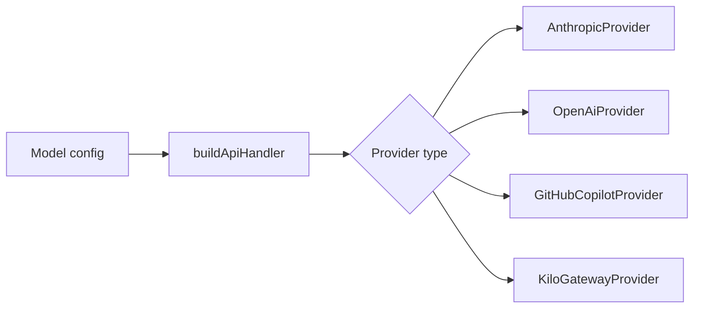

# Provider 认证

Obsilo 支持 Anthropic、OpenAI、GitHub Copilot、Kilo Gateway、Azure、OpenRouter、Ollama、LM Studio 以及自定义 OpenAI 兼容端点。每个提供商都有不同的认证要求，但 Agent 通过一个单一的 `ApiHandler` 接口进行通信。

## 工厂模式

`buildApiHandler` 工厂函数（`src/api/index.ts`）接收提供商配置并返回相应的实现类。Anthropic 有自己的 Provider 类。GitHub Copilot 和 Kilo Gateway 各自有专用类，因为它们的认证流程是非标准的。其他所有提供商（OpenAI、Azure、OpenRouter、Ollama、LM Studio、自定义端点）都通过 `OpenAiProvider` 处理，因为它们都使用 OpenAI API 格式。

工厂使用穷举式 switch 语句。向联合类型添加新的提供商类型时，TypeScript 会强制你处理它。

## 标准认证

大多数提供商使用 API key 认证。你在设置中粘贴你的 key，每次请求都会将其作为 Bearer token 发送。OpenAI 兼容的提供商（Ollama、LM Studio、OpenRouter、Azure、自定义）都以此方式工作，base URL 和 header 格式略有差异。

Ollama 和 LM Studio 是本地提供商，运行在你的机器上，完全不需要 API key。`OpenAiProvider` 通过在 base URL 指向 localhost 时将 key 设置为可选来处理这种情况。所有 HTTP 请求都通过 Obsidian 的 `requestUrl` API 发送，而不是原生的 `fetch`，这样可以使插件符合 Obsidian 的审核要求。

## GitHub Copilot：三阶段 Token 链

GitHub Copilot 认证需要三阶段流程，由 `GitHubCopilotAuthService`（`src/core/security/GitHubCopilotAuthService.ts`）处理：

1. 设备码流程。服务向 GitHub 请求设备码，然后向你显示一个 URL 和一个短码。你在浏览器中打开该 URL，输入验证码并授权应用程序。服务轮询直到授权完成。

2. Access token。GitHub 返回一个长期有效的 access token（有效期约 30 天），安全存储并用于获取短期的 Copilot token。

3. Copilot token。Access token 被交换为 Copilot 专用 token（有效期约 1 小时），随每个 API 请求发送。过期时，服务使用 access token 自动刷新。

自定义 fetch 包装器（`getCopilotFetch()`）被注入到 OpenAI SDK 中用于流式聊天补全，因为 SDK 内置的 fetch 无法处理 Copilot 的 token 格式。该包装器还处理 token 过期：如果请求因 401 失败，它会触发刷新并重试。

你可以在设置中为 enterprise GitHub 实例提供自定义 GitHub OAuth client ID。默认的 client ID 针对 github.com。

## Kilo Gateway：设备认证 + 手动 Token

`KiloAuthService`（`src/core/security/KiloAuthService.ts`）支持两种认证模式。设备授权流程与 GitHub Copilot 类似：你获取一个码，在浏览器中授权，服务轮询直到完成。或者，你可以直接粘贴 API token 以简化设置。

两种模式产生相同的会话状态。服务存储用户profile信息和提供商默认值（可用模型、速率限制），这些信息从网关 API `https://api.kilo.ai/api` 检索。

## 加密存储

在桌面端，`SafeStorageService`（`src/core/security/SafeStorageService.ts`）使用 Electron 的 `safeStorage` API 对凭证进行加密后再存储。这使用操作系统的密钥链（macOS 上的 Keychain、Windows 上的 Credential Manager、Linux 上的 libsecret）。

该服务通过动态 `require('electron')` 加载 Electron，这是少数允许使用 `require()` 而不是 ES 导入的地方之一，因为 Electron 只能在渲染进程中动态加载。

在移动端，Electron 不可用。凭证回退到 Obsidian 标准插件数据存储。这不如 OS 级加密安全，但移动版 Obsidian 没有暴露密钥链 API。

## 并发控制

Copilot 和 Kilo 认证服务都包含并发保护。如果多个请求同时触发 token 刷新，只有一次刷新会执行。其他请求等待同一个 promise。这可以防止重复认证请求和高频 API 使用期间的竞态条件。

## 添加新的提供商

要添加使用 OpenAI API 格式的提供商：将类型添加到 `src/types/settings.ts` 的 `LLMProvider` 联合类型中，在工厂 switch 中处理它（它会路由到 `OpenAiProvider`），并添加设置 UI 条目。如果提供商需要自定义认证流程，请创建专用 Provider 类和认证服务。

相关源文件：

| 文件 | 功能 |
|------|------|
| `src/api/index.ts` | 工厂函数，提供商路由 |
| `src/api/types.ts` | `ApiHandler` 接口，流类型 |
| `src/api/providers/anthropic.ts` | Anthropic SDK 集成 |
| `src/api/providers/openai.ts` | OpenAI 兼容提供商（处理 6+ 提供商） |
| `src/api/providers/github-copilot.ts` | 带自定义 fetch 的 Copilot 提供商 |
| `src/api/providers/kilo-gateway.ts` | 带设备认证的 Kilo Gateway |
| `src/core/security/SafeStorageService.ts` | Electron 密钥链加密 |
| `src/core/security/GitHubCopilotAuthService.ts` | 三阶段 Copilot 认证 |
| `src/core/security/KiloAuthService.ts` | Kilo 设备认证 + 手动 Token |