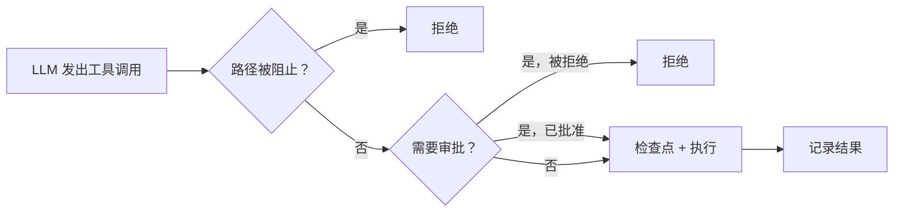

# 工具系统

工具是大语言模型可以调用的函数。每个工具都有名称、描述、输入的 JSON schema 和一个 `execute` 方法。这就是全部的抽象。

模型从不直接接触保险库。它通过发出工具调用来描述想要做什么，由工具系统决定是否执行以及如何执行。

## BaseTool

每个工具都继承自 `BaseTool`（`src/core/tools/BaseTool.ts`）：

```typescript
abstract class BaseTool<TName extends ToolName = ToolName> {
    abstract readonly name: TName;
    abstract readonly isWriteOperation: boolean;

    abstract getDefinition(): ToolDefinition;
    abstract execute(input: Record<string, unknown>, context: ToolExecutionContext): Promise<void>;

    protected validate(input: Record<string, unknown>): void { /* 可选 */ }
    protected formatError(error: unknown): string { /* 用 <error> 标签包装 */ }
}
```

`isWriteOperation` 是每个工具自行声明的，而非推断出来的。管道使用它来决定是否需要审批和检查点。`getDefinition()` 返回大语言模型看到的 JSON schema。`execute()` 接收一个 `ToolExecutionContext`，其中包含用于生成分子任务、切换模式、发出完成信号和请求审批的回调函数。

## ToolRegistry

`ToolRegistry`（`src/core/tools/ToolRegistry.ts`）是一个 `Map<ToolName, BaseTool>`。其构造函数接收插件实例和可选的服务引用（MCP 客户端、沙箱执行器、技能加载器），并在启动时注册所有内部工具。

注册表除了存储外还有一个职责：`getToolDefinitions(mode)` 根据活动模式的 `toolGroups` 设置过滤工具。只启用 `read` 组的模式不会向大语言模型暴露写操作工具。模型无法调用它看不到的东西。

## 工具组

工具被组织成六个组。每个组对应一个权限类别。

| 组 | 包含内容 | 对保险库的影响 |
|-------|-----------------|-----------------|
| `read` | read_file、read_document、list_files、search_files | 永不更改任何内容 |
| `vault` | get_frontmatter、search_by_tag、get_vault_stats、semantic_search、query_base、... | 只读元数据和搜索 |
| `edit` | write_file、edit_file、delete_file、move_file、create_pptx、generate_canvas、... | 修改或创建文件 |
| `web` | web_fetch、web_search | 外部网络访问 |
| `agent` | attempt_completion、switch_mode、new_task、evaluate_expression、manage_skill、... | 控制代理自身行为 |
| `mcp` | use_mcp_tool | 调用外部 MCP 服务器 |
| `skill` | execute_command、call_plugin_api、execute_recipe、... | 运行 Obsidian 命令和插件 API |

当你创建[自定义模式](/concepts/mode-system)时，你可以选择它获得哪些组。只包含 `read` 和 `vault` 的"问答"模式在物理上无法写入文件。

## 执行管道

每个工具调用都通过 `ToolExecutionPipeline`（`src/core/tool-execution/ToolExecutionPipeline.ts`）。以下是调用到结果的路径：



详细步骤：

1. 工具必须存在于注册表中。未知工具名称会返回错误。
2. `IgnoreService` 检查输入中的任何文件路径是否被阻止或写保护。如果路径被阻止，则调用被拒绝。
3. 写操作、MCP 调用、沙箱评估和分子任务生成都会经过 `checkApproval()`。如果没有审批回调，操作被拒绝。默认设计为故障关闭。
4. 每次写入前，git 快照会捕获文件的当前内容以供撤销。
5. 工具运行。结果通过 `OperationLogger` 记录到 JSONL 审计文件。

只读调用完全跳过步骤 3 和 4。

## 并行执行

当模型在单个响应中发出多个工具调用时，读操作安全的工具通过 `Promise.all()` 并发运行。写操作工具和控制流工具始终顺序执行。单个迭代可以并行解析四个 `read_file` 调用，而不是等待每一个完成。

区别很简单：如果 `isWriteOperation` 为 false 且工具在 `PARALLEL_SAFE` 集中，它就并发运行。其他所有工具排队等待。

## 动态工具

用户和代理可以在运行时创建工具。`DynamicToolFactory`（`src/core/tools/dynamic/`）从名称、schema 和执行函数构建工具实例。`DynamicToolLoader` 持久化定义，以便它们在会话间保留。

动态工具与内置工具一样通过相同的 `ToolExecutionPipeline`。写入文件的动态工具仍然需要审批，并且仍然会获得检查点。

## 工具重复检测

`ToolRepetitionDetector`（`src/core/tool-execution/ToolRepetitionDetector.ts`）在代理陷入使用相同参数重复调用同一工具的循环时捕获它。

它维护一个滑动窗口，记录最近 15 次调用。如果相同的 `tool:input` 组合出现 3 次或更多次，调用将被阻止并返回可恢复的错误。对于搜索工具，它还检查语义相似度。Jaccard 重叠超过 0.5 且出现 3 次以上的查询也会被阻止。

错误是有意设计为可恢复的。代理会看到消息，并可以尝试不同的方法。`AgentTask` 中的 `consecutiveMistakeLimit` 是最终的安全网，以防代理仍然持续失败。