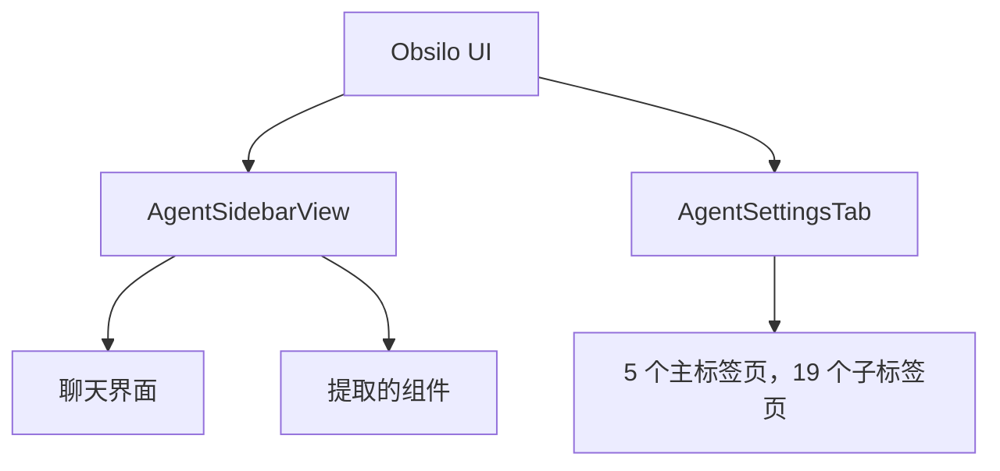

# UI 架构

Obsidian 插件不能使用 React、Vue 或任何依赖 `innerHTML` 的框架。社区插件审核机器人会拒绝直接设置 `innerHTML` 的插件。Obsilo UI 中的所有内容都使用 Obsidian 的 DOM API：`createEl`、`createDiv`、`createSpan`、`appendText`。比 JSX 更冗长，但这是平台的要求。

## 两个主要组件

`AgentSidebarView`（`src/ui/AgentSidebarView.ts`）是聊天界面。它扩展了 Obsidian 的 `ItemView` 并在侧边栏中渲染。您在此输入消息、查看回复、附加文件并观察 agent 工作。该视图管理 `AgentTask` 的生命周期：创建任务、发送消息、处理流式响应以及显示工具执行结果。它还处理模式选择器、模型选择器、上下文徽章显示以及停止/发送控制。

`AgentSettingsTab`（`src/ui/AgentSettingsTab.ts`）是设置界面。它扩展了 `PluginSettingTab` 并将配置组织在 5 个主标签页中，每个标签页下有子标签页：

| 主标签页 | 子标签页 |
|----------|----------|
| Providers | Models、Embeddings、Web Search、MCP Servers |
| Agent Behaviour | Modes、Permissions、Loop、Memory、Rules、Workflows、Skills、Prompts |
| Vault | （单个标签页） |
| Advanced | Interface、Shell、Visual Intelligence、Log、Debug、Backup |
| Language | （单个标签页） |

每个子标签页都是 `src/ui/settings/` 中的独立类。设置标签页构建导航栏并将渲染工作委托给活动的子标签页类。这使得 1500 多行的设置 UI 易于管理。

## 侧边栏提取的组件

侧边栏最初是一个大型文件。随着功能增加，组件被提取到 `src/ui/sidebar/` 中：

| 组件 | 用途 |
|------|------|
| `AttachmentHandler` | 拖放文件附件、文档解析 |
| `AutocompleteHandler` | 输入中的斜杠命令和 @ 提及 |
| `ToolPickerPopover` | Agent 需要选择时的工具选择弹出框 |
| `VaultFilePicker` | 从保险库中选择文件 |
| `HistoryPanel` | 对话历史浏览器 |
| `ContextDisplay` | Token 使用率和上下文窗口可视化 |
| `CondensationFeedback` | 上下文压缩发生时的通知 |
| `SuggestionBanner` | Agent 的主动建议 |
| `OnboardingFlow` | 首次运行设置向导 |

这些组件遵循一个通用模式：它们接收一个父元素和插件实例，创建自己的 DOM 子树，并暴露更新方法。没有组件生命周期管理器。每个组件拥有一个 DOM 子树并暴露一个小型的公共 API。

## CSS 限制

审核机器人禁止使用内联样式（`element.style.color = 'red'`）。所有样式都通过 CSS 类添加，前缀为 `agent-`（侧边栏）或 `agent-settings-`（设置）。工具类使用 `agent-u-` 前缀。动态样式（如进度条宽度）使用 `style.setProperty()` 而不是直接属性赋值。

CSS 作为与插件捆绑的单个样式表编写。Obsidian 的内置主题变量（`--text-normal`、`--background-primary` 等）尽可能使用，以便插件适配亮/暗主题和自定义主题。

## 模态框系统

Obsilo 使用 Obsidian 的 `Modal` 类来处理对话框：模型配置、代码导入、内容编辑、系统提示预览、任务选择和模式创建。每个模态框都是 `src/ui/settings/` 或 `src/ui/` 中的独立类。模态框遵循 Obsidian 的模式：扩展 `Modal`、重写 `onOpen` 和 `onClose`、在 `onOpen` 中构建 DOM。

## 渲染方式

没有虚拟 DOM、没有差异比较、没有响应式状态。当内容发生变化时，相关的部分会被清除并重建。设置标签页调用 `this.display()`，它清空容器并重建所有内容。侧边栏则更加精准：单个消息元素在流式传输过程中被追加，只有特定的元素在工具结果到达时更新。

聊天回复中的 Markdown 渲染使用 Obsidian 内置的 `MarkdownRenderer.render()`，它处理语法高亮、Wiki 链接和嵌入内容。这是 Obsilo 免费获得框架级渲染的一个领域。

## i18n

所有面向用户的文本都通过 `t()` 函数（`src/i18n`）处理，它返回当前语言的本地化字符串。设置 UI、侧边栏标签、错误消息和工具描述都是可翻译的。添加新语言意味着在 `src/i18n/locales/` 中添加一个语言文件。

## 任务提取和上下文

有两个功能位于聊天 UI 和系统其余部分之间。`TaskExtractor`（`src/core/tasks/TaskExtractor.ts`）扫描对话消息以查找操作项，并在选择模态框中呈现。选定的任务可以通过 `TaskNoteCreator` 成为保险库笔记。`ContextTracker`（`src/core/context/ContextTracker.ts`）监控 token 使用率并向 `ContextDisplay` 组件提供数据，后者显示上下文窗口的满载程度以及压缩即将发生的时间。

## 框架的权衡

使用无框架方式构建 UI 比 React 或 Svelte 更慢、更重复。每个按钮都需要 `createEl('button')`，每个列表都需要手动构建 DOM。但它有一个真正的优势：UI 无需构建步骤、无需维护框架版本、无需担心与 Obsidian 更新的兼容性问题。DOM API 是稳定的，在 Obsidian 版本之间不太可能出问题。以更冗长的代码换取更持久的兼容性，对于需要跨多个 Obsidian 版本可靠运行的插件来说是值得的。